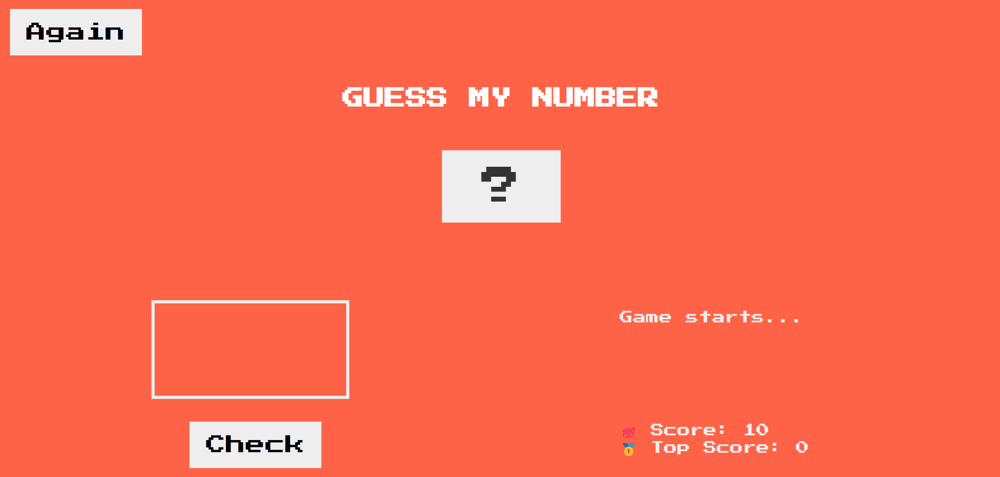
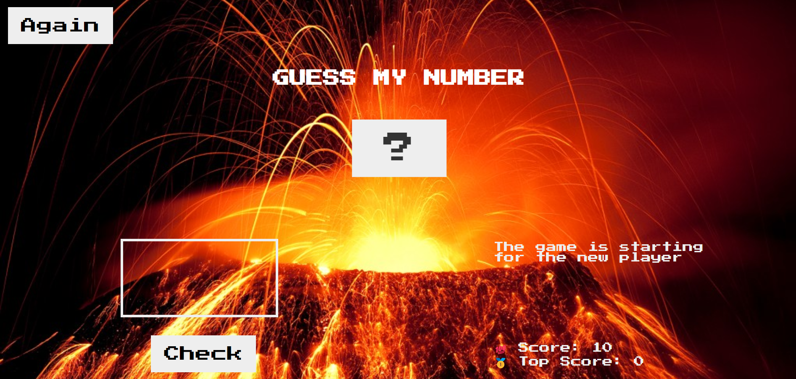
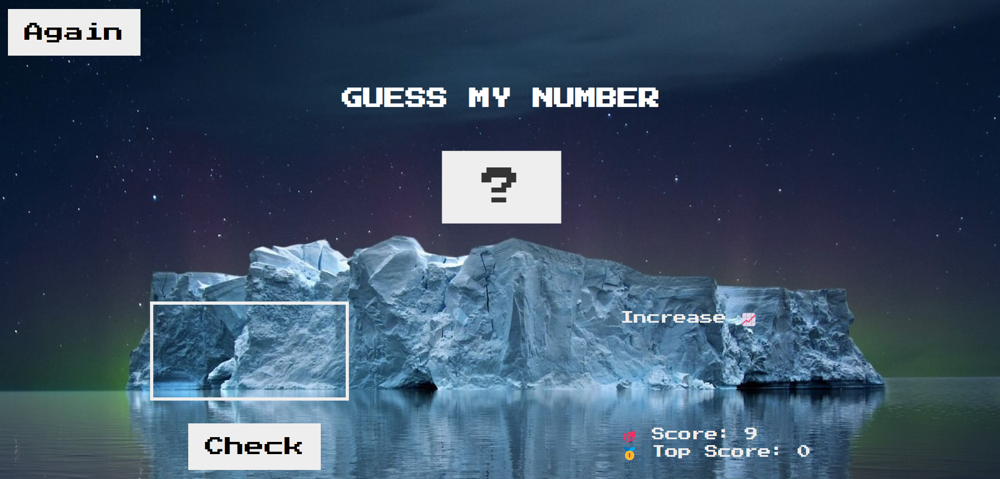

# Guess-My-Number

GuessMyNumber is a game which is developed using HTML, CSS and JavaScript. This is a small JavaScript project for beginners which includes DOM manipulation.

- <a href="https://karamanburak.github.io/Guess-My-Number/" rel="noFollow">Access the finished project online</a>

## About this Game

This is a guessing game in which the user has to guess the correct number between 1 and 20 (including both).

Initially the score is 10 and as the user guesses the wrong number, the score gets reduced by 1. Upon successful guess, the current score will be added to top score.

If the wrong score is greater than 5, a beautiful picture of an iceberg will appear in the background, if the wrong score is less than 5, a volcano will appear in the background.

The user can play this game again (by clicking on 'Again!' button). If the user scores more than the top score, then top score will get updated.

If the user can't guess the right number in 10 attempts, then he will lose.

